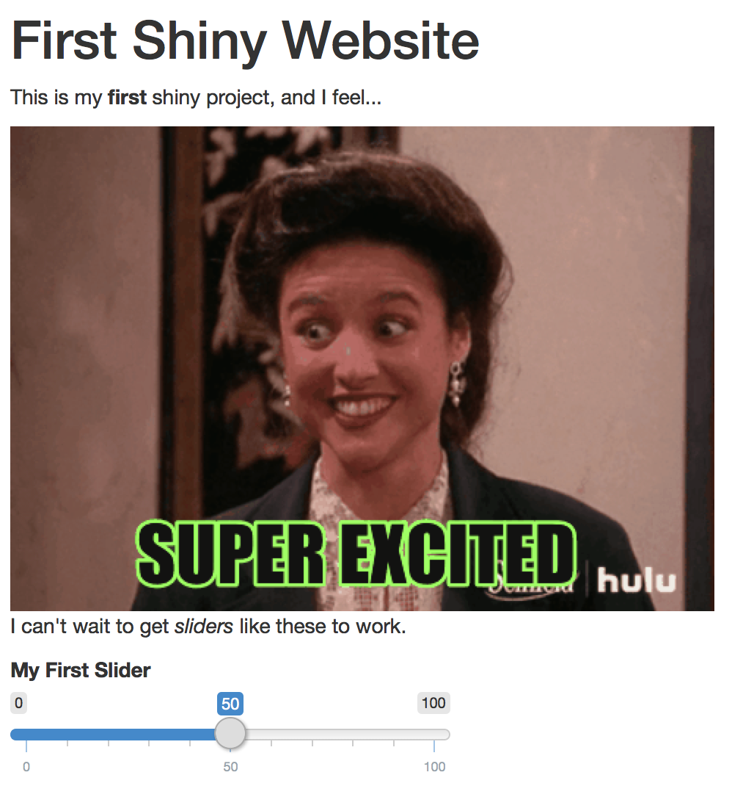

# Exercise 1
In this exercise, you'll practice building a shiny user interface. It will connect to a server, but it the server won't do anything. 

To complete the exercise, open the `exercise-1/app.R` file in RStudio, and follow the instructions there. The final product will look like this:

